# Flagix Sequence Diagrams

## Table of Contents
1. [SDK-Server: Flag Evaluation](#1-sdk-server-flag-evaluation)
2. [SDK-Server: SSE Streaming](#2-sdk-server-sse-streaming)
3. [SDK-Server: SDK Client Lifecycle](#3-sdk-server-sdk-client-lifecycle)
4. [Frontend-Server: Authentication Flow](#4-frontend-server-authentication-flow)
5. [Frontend-Server: Feature Flags CRUD](#5-frontend-server-feature-flags-crud)
6. [Frontend-Server: Targeting Rules Management](#6-frontend-server-targeting-rules-management)
7. [Frontend-Server: SDK Key Management](#7-frontend-server-sdk-key-management)
8. [Frontend-Server: Analytics Dashboard](#8-frontend-server-analytics-dashboard)
9. [Frontend-Server: Real-time Analytics Stream](#9-frontend-server-real-time-analytics-stream)
10. [Evaluation Pipeline (Internal)](#10-evaluation-pipeline-internal)

---

## 1. SDK-Server: Flag Evaluation

### 1.1 Single Flag Evaluation

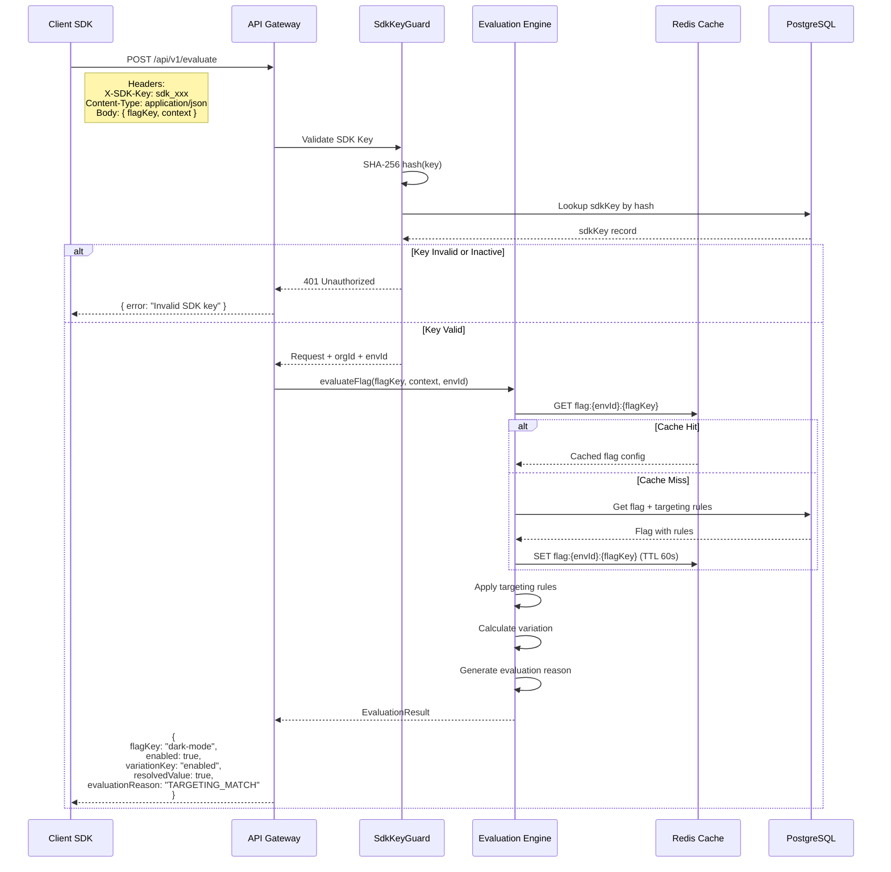
```mermaid
sequenceDiagram
    participant SDK as Client SDK
    participant API as API Gateway
    participant Guard as SdkKeyGuard
    participant Eval as Evaluation Engine
    participant Cache as Redis Cache
    participant DB as PostgreSQL

    SDK->>API: POST /api/v1/evaluate
    Note right of SDK: Headers:<br/>X-SDK-Key: sdk_xxx<br/>Content-Type: application/json<br/>Body: { flagKey, context }

    API->>Guard: Validate SDK Key
    Guard->>Guard: SHA-256 hash(key)
    Guard->>DB: Lookup sdkKey by hash
    DB-->>Guard: sdkKey record
    
    alt Key Invalid or Inactive
        Guard-->>API: 401 Unauthorized
        API-->>SDK: { error: "Invalid SDK key" }
    else Key Valid
        Guard-->>API: Request + orgId + envId
        API->>Eval: evaluateFlag(flagKey, context, envId)
        
        Eval->>Cache: GET flag:{envId}:{flagKey}
        alt Cache Hit
            Cache-->>Eval: Cached flag config
        else Cache Miss
            Eval->>DB: Get flag + targeting rules
            DB-->>Eval: Flag with rules
            Eval->>Cache: SET flag:{envId}:{flagKey} (TTL 60s)
        end
        
        Eval->>Eval: Apply targeting rules
        Eval->>Eval: Calculate variation
        Eval->>Eval: Generate evaluation reason
        
        Eval-->>API: EvaluationResult
        API-->>SDK: {<br/>  flagKey: "dark-mode",<br/>  enabled: true,<br/>  variationKey: "enabled",<br/>  resolvedValue: true,<br/>  evaluationReason: "TARGETING_MATCH"<br/>}
    end
```

### 1.2 All Flags Evaluation

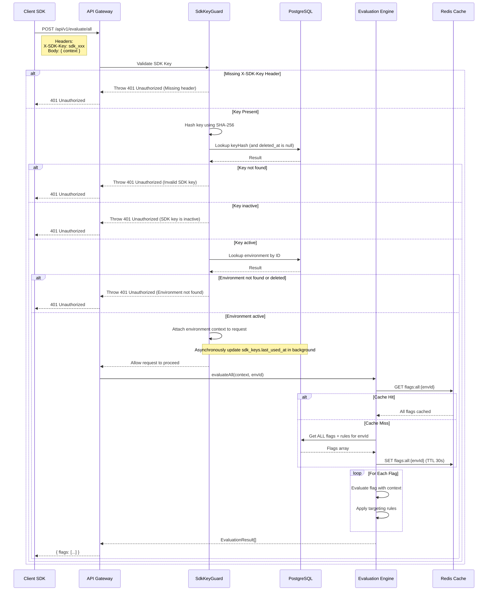
```mermaid
sequenceDiagram
    participant SDK as Client SDK
    participant API as API Gateway
    participant Guard as SdkKeyGuard
    participant DB as PostgreSQL
    participant Eval as Evaluation Engine
    participant Cache as Redis Cache

    SDK->>API: POST /api/v1/evaluate/all
    Note right of SDK: Headers:<br/>X-SDK-Key: sdk_xxx<br/>Body: { context }

    API->>Guard: Validate SDK Key

    alt Missing X-SDK-Key Header
        Guard-->>API: Throw 401 Unauthorized (Missing header)
        API-->>SDK: 401 Unauthorized
    else Key Present
        Guard->>Guard: Hash key using SHA-256
        Guard->>DB: Lookup keyHash (and deleted_at is null)
        DB-->>Guard: Result
        
        alt Key not found
            Guard-->>API: Throw 401 Unauthorized (Invalid SDK key)
            API-->>SDK: 401 Unauthorized
        else Key inactive
            Guard-->>API: Throw 401 Unauthorized (SDK key is inactive)
            API-->>SDK: 401 Unauthorized
        else Key active
            Guard->>DB: Lookup environment by ID
            DB-->>Guard: Result
            
            alt Environment not found or deleted
                Guard-->>API: Throw 401 Unauthorized (Environment not found)
                API-->>SDK: 401 Unauthorized
            else Environment active
                Guard->>Guard: Attach environment context to request
                Note over Guard,DB: Asynchronously update sdk_keys.last_used_at in background
                Guard-->>API: Allow request to proceed
                
                API->>Eval: evaluateAll(context, envId)
                Eval->>Cache: GET flags:all:{envId}
                
                alt Cache Hit
                    Cache-->>Eval: All flags cached
                else Cache Miss
                    Eval->>DB: Get ALL flags + rules for envId
                    DB-->>Eval: Flags array
                    Eval->>Cache: SET flags:all:{envId} (TTL 30s)
                end

                loop For Each Flag
                    Eval->>Eval: Evaluate flag with context
                    Eval->>Eval: Apply targeting rules
                end

                Eval-->>API: EvaluationResult[]
                API-->>SDK: { flags: [...] }
            end
        end
    end
```

---

## 2. SDK-Server: SSE Streaming

### 2.1 SSE Connection Setup

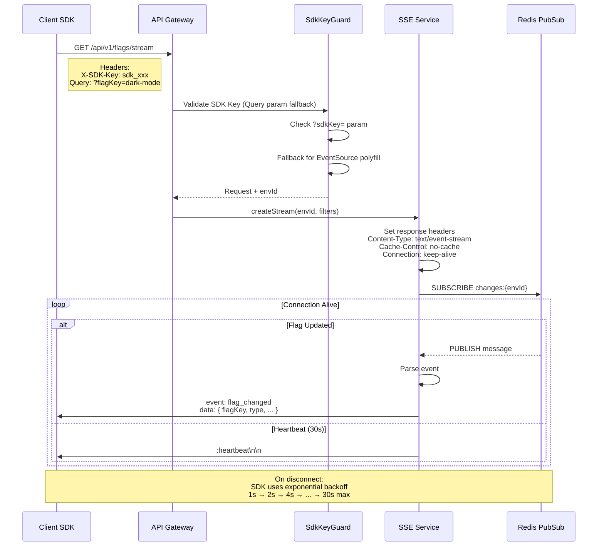
```mermaid
sequenceDiagram
    participant SDK as Client SDK
    participant API as API Gateway
    participant Guard as SdkKeyGuard
    participant SSE as SSE Service
    participant Redis as Redis PubSub

    SDK->>API: GET /api/v1/flags/stream
    Note right of SDK: Headers:<br/>X-SDK-Key: sdk_xxx<br/>Query: ?flagKey=dark-mode

    API->>Guard: Validate SDK Key (Query param fallback)
    Guard->>Guard: Check ?sdkKey= param
    Guard->>Guard: Fallback for EventSource polyfill
    Guard-->>API: Request + envId

    API->>SSE: createStream(envId, filters)
    SSE->>SSE: Set response headers<br/>Content-Type: text/event-stream<br/>Cache-Control: no-cache<br/>Connection: keep-alive
    
    SSE->>Redis: SUBSCRIBE changes:{envId}
    
    loop Connection Alive
        alt Flag Updated
            Redis-->>SSE: PUBLISH message
            SSE->>SSE: Parse event
            SSE->>SDK: event: flag_changed<br/>data: { flagKey, type, ... }
        else Heartbeat (30s)
            SSE->>SDK: :heartbeat\n\n
        end
    end

    Note over SDK,Redis: On disconnect:<br/>SDK uses exponential backoff<br/>1s → 2s → 4s → ... → 30s max
```

### 2.2 SSE Event Flow

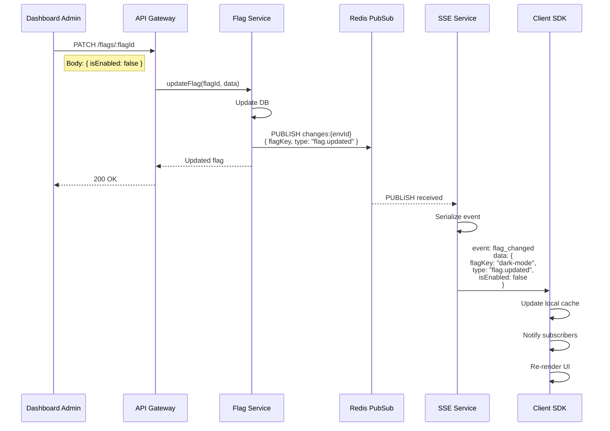
```mermaid
sequenceDiagram
    participant Admin as Dashboard Admin
    participant API as API Gateway
    participant FlagService as Flag Service
    participant Redis as Redis PubSub
    participant SSE as SSE Service
    participant SDK as Client SDK

    Admin->>API: PATCH /flags/:flagId
    Note right of Admin: Body: { isEnabled: false }

    API->>FlagService: updateFlag(flagId, data)
    FlagService->>FlagService: Update DB
    FlagService->>Redis: PUBLISH changes:{envId}<br/>{ flagKey, type: "flag.updated" }
    FlagService-->>API: Updated flag
    API-->>Admin: 200 OK

    Redis-->>SSE: PUBLISH received
    SSE->>SSE: Serialize event
    SSE->>SDK: event: flag_changed<br/>data: {<br/>  flagKey: "dark-mode",<br/>  type: "flag.updated",<br/>  isEnabled: false<br/>}

    SDK->>SDK: Update local cache
    SDK->>SDK: Notify subscribers
    SDK->>SDK: Re-render UI
```

---

## 3. SDK-Server: SDK Client Lifecycle

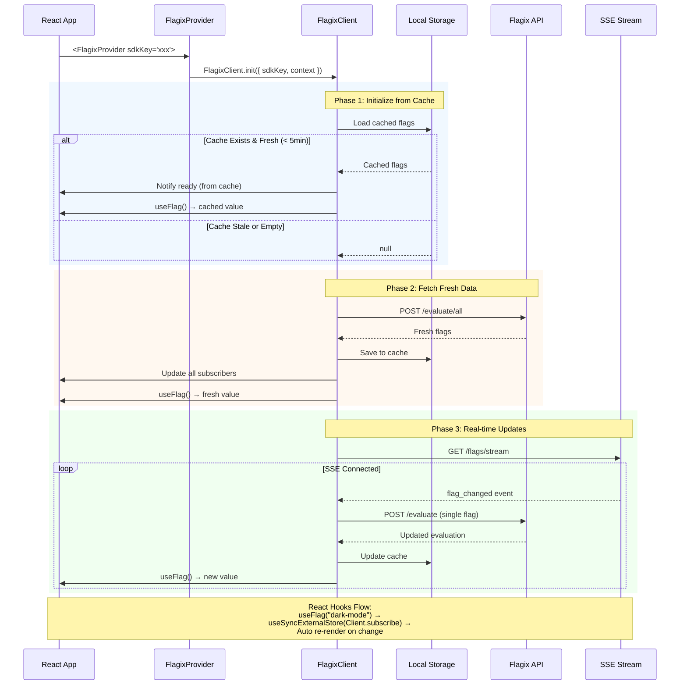
```mermaid
sequenceDiagram
    participant App as React App
    participant Provider as FlagixProvider
    participant Client as FlagixClient
    participant Cache as Local Storage
    participant API as Flagix API
    participant SSE as SSE Stream

    App->>Provider: <FlagixProvider sdkKey="xxx">
    Provider->>Client: FlagixClient.init({ sdkKey, context })

    rect rgb(240, 248, 255)
        Note over Client,Cache: Phase 1: Initialize from Cache
        Client->>Cache: Load cached flags
        alt Cache Exists & Fresh (< 5min)
            Cache-->>Client: Cached flags
            Client->>App: Notify ready (from cache)
            Client->>App: useFlag() → cached value
        else Cache Stale or Empty
            Cache-->>Client: null
        end
    end

    rect rgb(255, 248, 240)
        Note over Client,API: Phase 2: Fetch Fresh Data
        Client->>API: POST /evaluate/all
        API-->>Client: Fresh flags
        Client->>Cache: Save to cache
        Client->>App: Update all subscribers
        Client->>App: useFlag() → fresh value
    end

    rect rgb(240, 255, 240)
        Note over Client,SSE: Phase 3: Real-time Updates
        Client->>SSE: GET /flags/stream
        loop SSE Connected
            SSE-->>Client: flag_changed event
            Client->>API: POST /evaluate (single flag)
            API-->>Client: Updated evaluation
            Client->>Cache: Update cache
            Client->>App: useFlag() → new value
        end
    end

    Note over App, SSE: React Hooks Flow:<br/>useFlag("dark-mode") →<br/>useSyncExternalStore(Client.subscribe) →<br/>Auto re-render on change
```

---

## 4. Frontend-Server: Authentication Flow

### 4.1 Better Auth Session

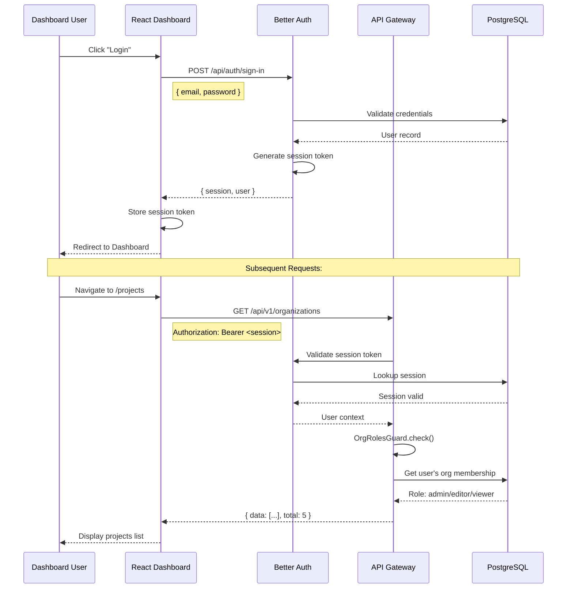
```mermaid
sequenceDiagram
    participant User as Dashboard User
    participant Frontend as React Dashboard
    participant Auth as Better Auth
    participant API as API Gateway
    participant DB as PostgreSQL

    User->>Frontend: Click "Login"
    Frontend->>Auth: POST /api/auth/sign-in
    Note right of Frontend: { email, password }

    Auth->>DB: Validate credentials
    DB-->>Auth: User record
    Auth->>Auth: Generate session token
    Auth-->>Frontend: { session, user }
    Frontend->>Frontend: Store session token
    Frontend-->>User: Redirect to Dashboard

    Note over User, DB: Subsequent Requests:
    User->>Frontend: Navigate to /projects
    Frontend->>API: GET /api/v1/organizations
    Note right of Frontend: Authorization: Bearer <session>

    API->>Auth: Validate session token
    Auth->>DB: Lookup session
    DB-->>Auth: Session valid
    Auth-->>API: User context

    API->>API: OrgRolesGuard.check()
    API->>DB: Get user's org membership
    DB-->>API: Role: admin/editor/viewer
    API-->>Frontend: { data: [...], total: 5 }
    Frontend-->>User: Display projects list
```

### 4.2 Organization Role Guard

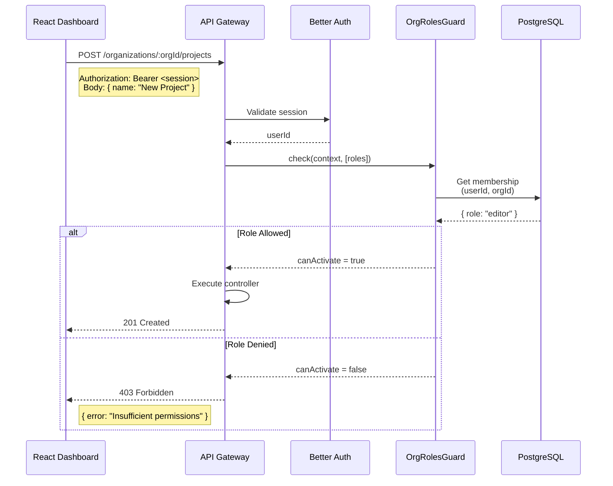
```mermaid
sequenceDiagram
    participant Frontend as React Dashboard
    participant API as API Gateway
    participant Auth as Better Auth
    participant Guard as OrgRolesGuard
    participant DB as PostgreSQL

    Frontend->>API: POST /organizations/:orgId/projects
    Note right of Frontend: Authorization: Bearer <session><br/>Body: { name: "New Project" }

    API->>Auth: Validate session
    Auth-->>API: userId

    API->>Guard: check(context, [roles])
    Guard->>DB: Get membership<br/>(userId, orgId)
    DB-->>Guard: { role: "editor" }

    alt Role Allowed
        Guard-->>API: canActivate = true
        API->>API: Execute controller
        API-->>Frontend: 201 Created
    else Role Denied
        Guard-->>API: canActivate = false
        API-->>Frontend: 403 Forbidden
        Note right of Frontend: { error: "Insufficient permissions" }
    end
```

---

## 5. Frontend-Server: Feature Flags CRUD

### 5.1 List Flags

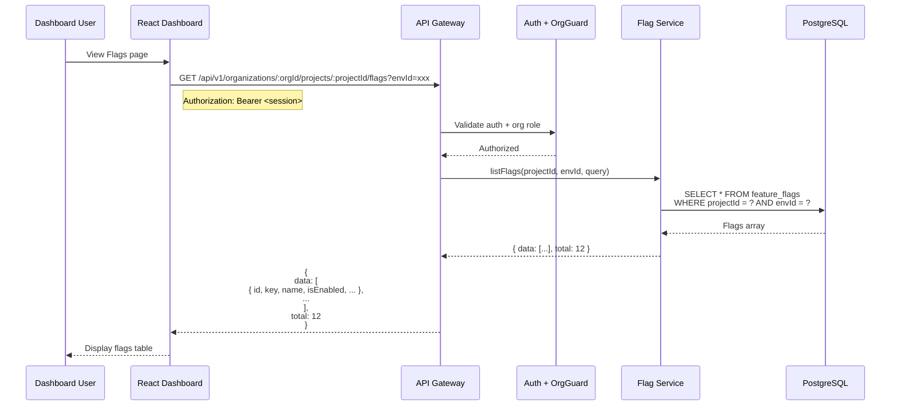
```mermaid
sequenceDiagram
    participant User as Dashboard User
    participant Frontend as React Dashboard
    participant API as API Gateway
    participant Guard as Auth + OrgGuard
    participant Service as Flag Service
    participant DB as PostgreSQL

    User->>Frontend: View Flags page
    Frontend->>API: GET /api/v1/organizations/:orgId/projects/:projectId/flags?envId=xxx
    Note right of Frontend: Authorization: Bearer <session>

    API->>Guard: Validate auth + org role
    Guard-->>API: Authorized

    API->>Service: listFlags(projectId, envId, query)
    Service->>DB: SELECT * FROM feature_flags<br/>WHERE projectId = ? AND envId = ?
    DB-->>Service: Flags array

    Service-->>API: { data: [...], total: 12 }
    API-->>Frontend: {<br/>  data: [<br/>    { id, key, name, isEnabled, ... },<br/>    ...<br/>  ],<br/>  total: 12<br/>}
    Frontend-->>User: Display flags table
```

### 5.2 Create Flag

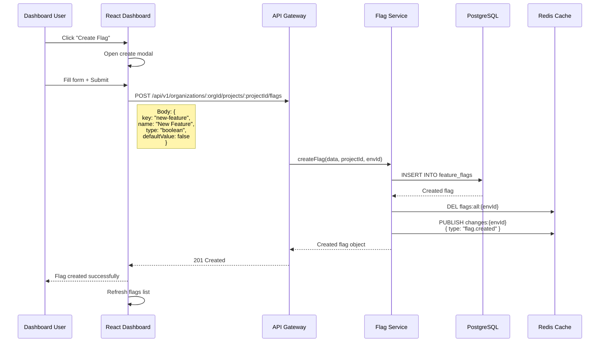
```mermaid
sequenceDiagram
    participant User as Dashboard User
    participant Frontend as React Dashboard
    participant API as API Gateway
    participant Service as Flag Service
    participant DB as PostgreSQL
    participant Redis as Redis Cache

    User->>Frontend: Click "Create Flag"
    Frontend->>Frontend: Open create modal
    User->>Frontend: Fill form + Submit
    Frontend->>API: POST /api/v1/organizations/:orgId/projects/:projectId/flags
    Note right of Frontend: Body: {<br/>  key: "new-feature",<br/>  name: "New Feature",<br/>  type: "boolean",<br/>  defaultValue: false<br/>}

    API->>Service: createFlag(data, projectId, envId)
    
    Service->>DB: INSERT INTO feature_flags
    DB-->>Service: Created flag

    Service->>Redis: DEL flags:all:{envId}
    Service->>Redis: PUBLISH changes:{envId}<br/>{ type: "flag.created" }

    Service-->>API: Created flag object
    API-->>Frontend: 201 Created
    Frontend-->>User: Flag created successfully
    Frontend->>Frontend: Refresh flags list
```

### 5.3 Update Flag State

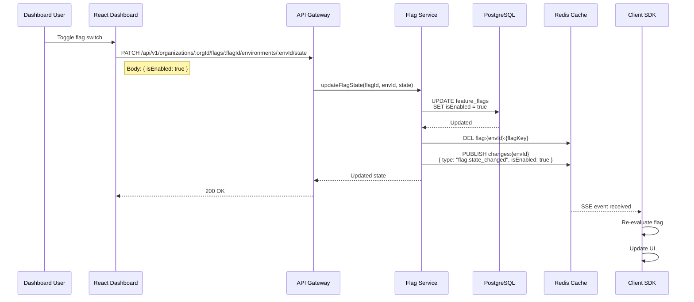
```mermaid
sequenceDiagram
    participant User as Dashboard User
    participant Frontend as React Dashboard
    participant API as API Gateway
    participant Service as Flag Service
    participant DB as PostgreSQL
    participant Redis as Redis Cache
    participant SDK as Client SDK

    User->>Frontend: Toggle flag switch
    Frontend->>API: PATCH /api/v1/organizations/:orgId/flags/:flagId/environments/:envId/state
    Note right of Frontend: Body: { isEnabled: true }

    API->>Service: updateFlagState(flagId, envId, state)
    
    Service->>DB: UPDATE feature_flags<br/>SET isEnabled = true
    DB-->>Service: Updated

    Service->>Redis: DEL flag:{envId}:{flagKey}
    Service->>Redis: PUBLISH changes:{envId}<br/>{ type: "flag.state_changed", isEnabled: true }

    Service-->>API: Updated state
    API-->>Frontend: 200 OK

    Redis-->>SDK: SSE event received
    SDK->>SDK: Re-evaluate flag
    SDK->>SDK: Update UI
```

---

## 6. Frontend-Server: Targeting Rules Management

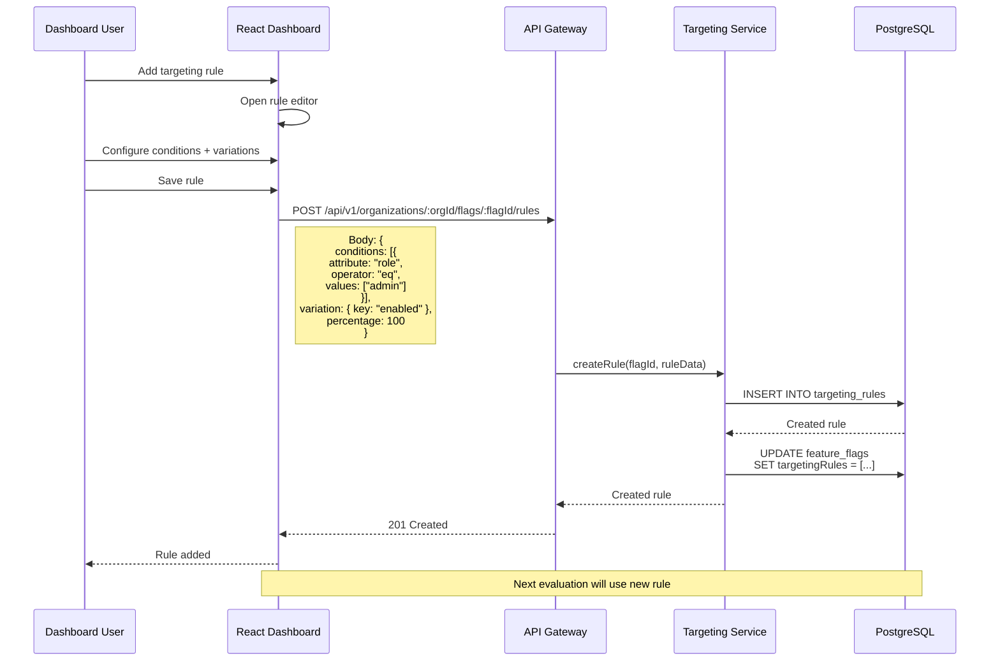
```mermaid
sequenceDiagram
    participant User as Dashboard User
    participant Frontend as React Dashboard
    participant API as API Gateway
    participant Service as Targeting Service
    participant DB as PostgreSQL

    User->>Frontend: Add targeting rule
    Frontend->>Frontend: Open rule editor
    User->>Frontend: Configure conditions + variations
    User->>Frontend: Save rule

    Frontend->>API: POST /api/v1/organizations/:orgId/flags/:flagId/rules
    Note right of Frontend: Body: {<br/>  conditions: [{<br/>    attribute: "role",<br/>    operator: "eq",<br/>    values: ["admin"]<br/>  }],<br/>  variation: { key: "enabled" },<br/>  percentage: 100<br/>}

    API->>Service: createRule(flagId, ruleData)
    
    Service->>DB: INSERT INTO targeting_rules
    DB-->>Service: Created rule

    Service->>DB: UPDATE feature_flags<br/>SET targetingRules = [...]
    
    Service-->>API: Created rule
    API-->>Frontend: 201 Created
    Frontend-->>User: Rule added

    Note over Frontend, DB: Next evaluation will use new rule
```

---

## 7. Frontend-Server: SDK Key Management

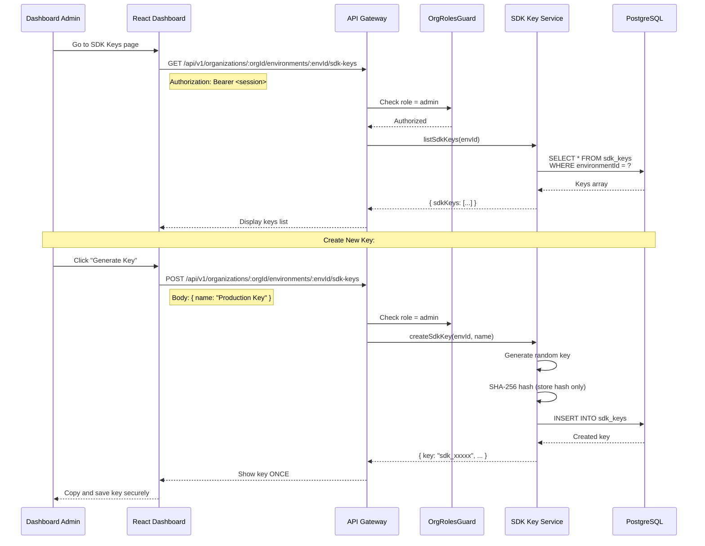
```mermaid
sequenceDiagram
    participant Admin as Dashboard Admin
    participant Frontend as React Dashboard
    participant API as API Gateway
    participant Guard as OrgRolesGuard
    participant Service as SDK Key Service
    participant DB as PostgreSQL

    Admin->>Frontend: Go to SDK Keys page
    Frontend->>API: GET /api/v1/organizations/:orgId/environments/:envId/sdk-keys
    Note right of Frontend: Authorization: Bearer <session>

    API->>Guard: Check role = admin
    Guard-->>API: Authorized

    API->>Service: listSdkKeys(envId)
    Service->>DB: SELECT * FROM sdk_keys<br/>WHERE environmentId = ?
    DB-->>Service: Keys array
    Service-->>API: { sdkKeys: [...] }
    API-->>Frontend: Display keys list

    Note over Admin, DB: Create New Key:
    Admin->>Frontend: Click "Generate Key"
    Frontend->>API: POST /api/v1/organizations/:orgId/environments/:envId/sdk-keys
    Note right of Frontend: Body: { name: "Production Key" }

    API->>Guard: Check role = admin
    API->>Service: createSdkKey(envId, name)
    Service->>Service: Generate random key
    Service->>Service: SHA-256 hash (store hash only)
    Service->>DB: INSERT INTO sdk_keys
    DB-->>Service: Created key

    Service-->>API: { key: "sdk_xxxxx", ... }
    API-->>Frontend: Show key ONCE
    Frontend-->>Admin: Copy and save key securely
```

---

## 8. Frontend-Server: Analytics Dashboard

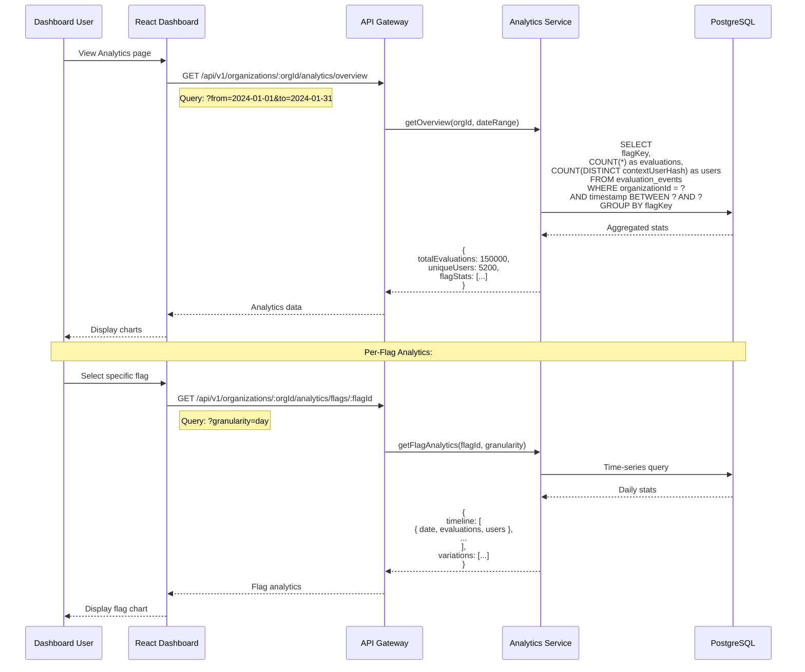
```mermaid
sequenceDiagram
    participant User as Dashboard User
    participant Frontend as React Dashboard
    participant API as API Gateway
    participant Service as Analytics Service
    participant DB as PostgreSQL

    User->>Frontend: View Analytics page
    Frontend->>API: GET /api/v1/organizations/:orgId/analytics/overview
    Note right of Frontend: Query: ?from=2024-01-01&to=2024-01-31

    API->>Service: getOverview(orgId, dateRange)
    
    Service->>DB: SELECT <br/>  flagKey,<br/>  COUNT(*) as evaluations,<br/>  COUNT(DISTINCT contextUserHash) as users<br/>FROM evaluation_events<br/>WHERE organizationId = ?<br/>AND timestamp BETWEEN ? AND ?<br/>GROUP BY flagKey
    DB-->>Service: Aggregated stats

    Service-->>API: {<br/>  totalEvaluations: 150000,<br/>  uniqueUsers: 5200,<br/>  flagStats: [...]<br/>}
    API-->>Frontend: Analytics data
    Frontend-->>User: Display charts

    Note over User, DB: Per-Flag Analytics:
    User->>Frontend: Select specific flag
    Frontend->>API: GET /api/v1/organizations/:orgId/analytics/flags/:flagId
    Note right of Frontend: Query: ?granularity=day

    API->>Service: getFlagAnalytics(flagId, granularity)
    Service->>DB: Time-series query
    DB-->>Service: Daily stats
    Service-->>API: {<br/>  timeline: [<br/>    { date, evaluations, users },<br/>    ...<br/>  ],<br/>  variations: [...]<br/>}
    API-->>Frontend: Flag analytics
    Frontend-->>User: Display flag chart
```

---

## 9. Frontend-Server: Real-time Analytics Stream

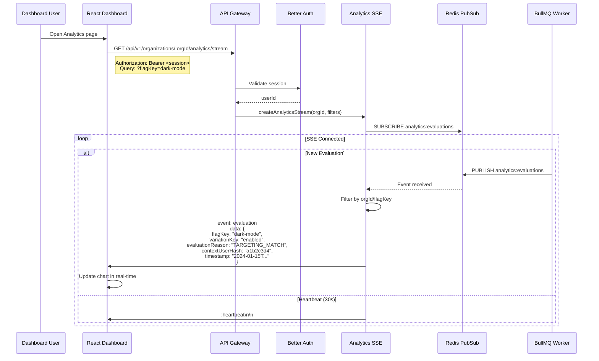
```mermaid
sequenceDiagram
    participant User as Dashboard User
    participant Frontend as React Dashboard
    participant API as API Gateway
    participant Auth as Better Auth
    participant SSE as Analytics SSE
    participant Redis as Redis PubSub
    participant Worker as BullMQ Worker

    User->>Frontend: Open Analytics page
    Frontend->>API: GET /api/v1/organizations/:orgId/analytics/stream
    Note right of Frontend: Authorization: Bearer <session><br/>Query: ?flagKey=dark-mode

    API->>Auth: Validate session
    Auth-->>API: userId

    API->>SSE: createAnalyticsStream(orgId, filters)
    SSE->>Redis: SUBSCRIBE analytics:evaluations

    loop SSE Connected
        alt New Evaluation
            Worker->>Redis: PUBLISH analytics:evaluations
            Redis-->>SSE: Event received
            SSE->>SSE: Filter by orgId/flagKey
            SSE->>Frontend: event: evaluation<br/>data: {<br/>  flagKey: "dark-mode",<br/>  variationKey: "enabled",<br/>  evaluationReason: "TARGETING_MATCH",<br/>  contextUserHash: "a1b2c3d4",<br/>  timestamp: "2024-01-15T..."<br/>}
            Frontend->>Frontend: Update chart in real-time
        else Heartbeat (30s)
            SSE->>Frontend: :heartbeat\n\n
        end
    end
```

---

## 10. Evaluation Pipeline (Internal)

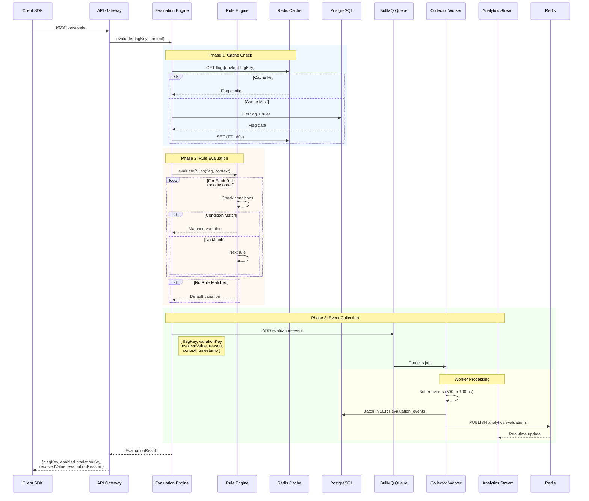
```mermaid
sequenceDiagram
    participant SDK as Client SDK
    participant API as API Gateway
    participant Eval as Evaluation Engine
    participant Rules as Rule Engine
    participant Cache as Redis Cache
    participant DB as PostgreSQL
    participant Queue as BullMQ Queue
    participant Worker as Collector Worker
    participant Analytics as Analytics Stream

    SDK->>API: POST /evaluate
    API->>Eval: evaluate(flagKey, context)

    rect rgb(240, 248, 255)
        Note over Eval,Cache: Phase 1: Cache Check
        Eval->>Cache: GET flag:{envId}:{flagKey}
        alt Cache Hit
            Cache-->>Eval: Flag config
        else Cache Miss
            Eval->>DB: Get flag + rules
            DB-->>Eval: Flag data
            Eval->>Cache: SET (TTL 60s)
        end
    end

    rect rgb(255, 248, 240)
        Note over Eval,Rules: Phase 2: Rule Evaluation
        Eval->>Rules: evaluateRules(flag, context)
        
        loop For Each Rule (priority order)
            Rules->>Rules: Check conditions
            alt Condition Match
                Rules-->>Eval: Matched variation
            else No Match
                Rules->>Rules: Next rule
            end
        end
        
        alt No Rule Matched
            Rules-->>Eval: Default variation
        end
    end

    rect rgb(240, 255, 240)
        Note over Eval,Analytics: Phase 3: Event Collection
        Eval->>Queue: ADD evaluation-event
        Note right of Eval: { flagKey, variationKey,<br/>resolvedValue, reason,<br/>context, timestamp }
        
        Queue->>Worker: Process job
        
        rect rgb(255, 255, 240)
            Note over Worker,Analytics: Worker Processing
            Worker->>Worker: Buffer events (500 or 100ms)
            Worker->>DB: Batch INSERT evaluation_events
            Worker->>Redis: PUBLISH analytics:evaluations
            Redis-->>Analytics: Real-time update
        end
    end

    Eval-->>API: EvaluationResult
    API-->>SDK: { flagKey, enabled, variationKey,<br/>resolvedValue, evaluationReason }
```

---

## Authentication Summary

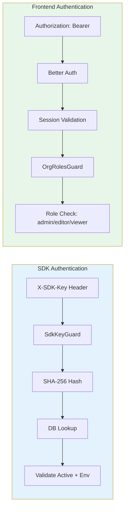
```mermaid
graph LR
    subgraph SDK["SDK Authentication"]
        A[X-SDK-Key Header] --> B[SdkKeyGuard]
        B --> C[SHA-256 Hash]
        C --> D[DB Lookup]
        D --> E[Validate Active + Env]
    end

    subgraph Frontend["Frontend Authentication"]
        F[Authorization: Bearer] --> G[Better Auth]
        G --> H[Session Validation]
        H --> I[OrgRolesGuard]
        I --> J[Role Check: admin/editor/viewer]
    end

    style SDK fill:#e3f2fd
    style Frontend fill:#e8f5e9
```

---

## Rate Limiting

| Endpoint | Limit | TTL | Tracker |
|----------|-------|-----|---------|
| `/evaluate` | 1000 req | 60s | SDK Key or IP |
| `/evaluate/all` | 1000 req | 60s | SDK Key or IP |
| `/flags/stream` | 100 req | 60s | SDK Key or IP |
| Auth endpoints | 1000 req | 60s | IP |
| Other API | 100 req | 60s | Session |

---

## Error Handling

| Error Code | Scenario | Response |
|------------|----------|----------|
| 401 | Invalid/missing SDK key | `{ error: "Invalid SDK key" }` |
| 403 | Insufficient org role | `{ error: "Insufficient permissions" }` |
| 404 | Flag/resource not found | `{ error: "Not found" }` |
| 429 | Rate limit exceeded | `{ error: "Too many requests" }` |
| 500 | Internal server error | `{ error: "Internal server error" }` |

---

*Generated for Flagix R&D Report*
